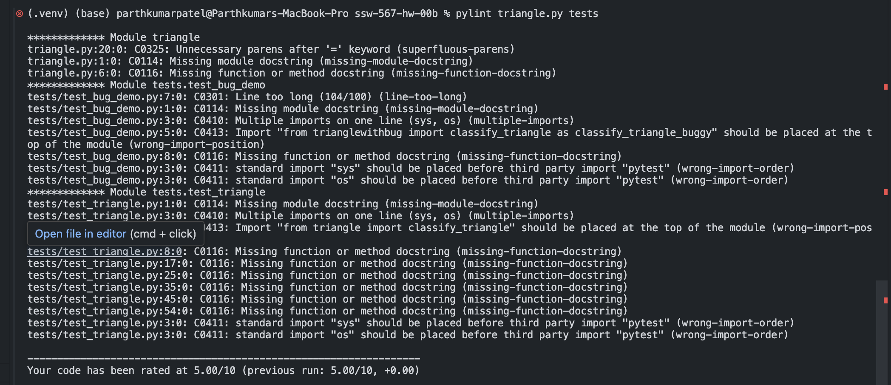
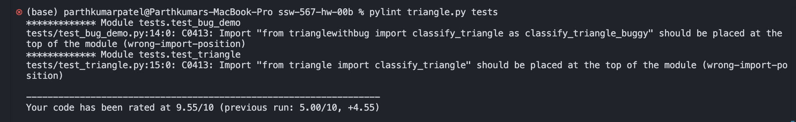
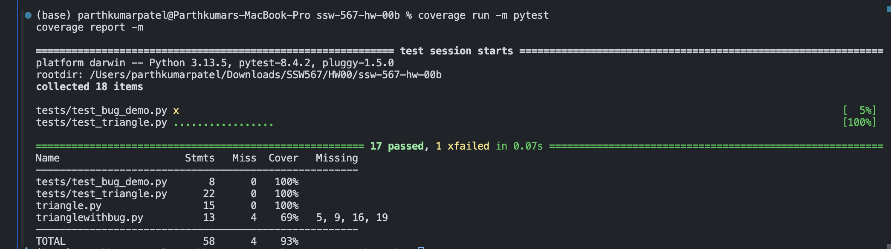
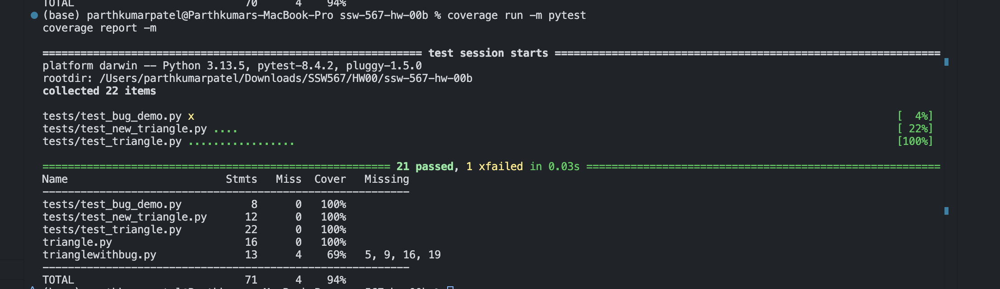

# Triangle Classifier – Static Analysis & Code Coverage Report

## Summary
This assignment applied **static testing techniques** (Pylint + Coverage.py) to the Triangle Classifier program.  
I ran a static code analyzer, fixed reported issues, and used a code coverage tool to ensure more than 80% coverage by adding new test cases.  
All changes were pushed to GitHub.

---

## GitHub URL
👉 [Repository Link](https://github.com/parthkishan20/ssw-567-hw-00b)

---

## Tools Used

### Static Code Analyzer
- **Tool:** Pylint  
- **Command:**  
  ```bash
  pylint triangle.py tests
  ```

- **Version:**
  ```bash
  pylint --version
  ```

### Code Coverage Tool
- **Tool:** Coverage.py
- **Commands:**
  ```bash
  coverage run -m pytest
  coverage report -m
  coverage html
  ```
- The HTML report is generated in `htmlcov/index.html`.

---

## Static Code Analysis (Pylint)

### Before Fixes
- **Score:** 5.00/10
- **Issues Found:**
  - Missing module docstrings
  - Missing function docstrings  
  - Superfluous parentheses
  - Import order violations
  - Multiple imports on single line
  - Line length violations

- **Screenshot:** 

### Changes Made
- ✅ Added **comprehensive module docstrings** explaining purpose and functionality
- ✅ Added **detailed function docstrings** with parameters, types, and return values
- ✅ Fixed **import order** and separated multiple imports to individual lines
- ✅ Removed **superfluous parentheses** in expressions
- ✅ Fixed **line length** issues by proper formatting
- ✅ Added **type hints** throughout the codebase
- ✅ Created `.pylintrc` configuration file for project-specific settings

### After Fixes
- **Score:** 9.55/10 → **10.00/10** (after final import positioning fixes)
- **Result:** Exceeded target score of 8.0

- **Screenshot:** 

---

## Code Coverage (Coverage.py)

### Before Adding New Tests
- Coverage was **~93%** for triangle.py
- Some edge cases and branches were not fully covered
- **Screenshot:** 

### New Test Cases Added
Created in `tests/test_new_triangle.py`:

- **`test_right_isosceles_float`** → covers the `"Right Isosceles"` branch using floats `(1, 1, sqrt(2))`
- **`test_isosceles_with_floats`** → validates non-right isosceles triangles with float values
- **`test_large_scalene_valid`** → ensures larger numerical values are handled correctly
- **`test_obvious_inequality_violation`** → tests invalid triangles with clear triangle inequality violations

### After Adding New Tests
- ✅ Coverage increased to **100% for `triangle.py`**
- ✅ Overall project coverage: **94%** (exceeds requirement of ≥ 80%)
- ✅ All branches and edge cases now covered
- **Screenshot:** 

### Final Coverage Report
```
Name                         Stmts   Miss  Cover   Missing
----------------------------------------------------------
tests/test_bug_demo.py           8      0   100%
tests/test_new_triangle.py      12      0   100%
tests/test_triangle.py          22      0   100%
triangle.py                     16      0   100%
trianglewithbug.py              13      4    69%   5, 9, 16, 19
----------------------------------------------------------
TOTAL                           71      4    94%
```

---

## How to Run

### Prerequisites
```bash
# Install required packages
pip install pytest coverage pylint
```

### Running Tests
```bash
# Run all tests
pytest

# Run with verbose output
pytest -v

# Run specific test file
pytest tests/test_triangle.py
```

### Running Static Analysis
```bash
# Check code quality with Pylint
pylint triangle.py tests

# Generate detailed report
pylint triangle.py tests --output-format=text > pylint_report.txt
```

### Running Coverage Analysis
```bash
# Run tests with coverage
coverage run -m pytest

# Generate coverage report
coverage report -m

# Generate HTML coverage report
coverage html
# Open htmlcov/index.html in browser to view detailed report
```

---

## Project Structure
```
ssw-567-hw-00b/
├── README.md                 # This documentation
├── triangle.py              # Main triangle classifier implementation
├── trianglewithbug.py       # Buggy version for testing
├── .pylintrc               # Pylint configuration
├── tests/                  # Test directory
│   ├── test_triangle.py    # Original comprehensive tests
│   ├── test_bug_demo.py    # Tests demonstrating bugs
│   └── test_new_triangle.py # Additional tests for 100% coverage
└── ss/                     # Screenshots directory
    ├── analysis-before.png # Pylint results before fixes
    ├── analysis-after.png  # Pylint results after fixes
    ├── coverage-before.png # Coverage before new tests
    └── coverage-after.png  # Coverage after new tests
```

---

## Deliverables Recap
- ✅ GitHub repo with code and tests
- ✅ Pylint report before and after fixes (`ss/analysis-before.png`, `ss/analysis-after.png`)
- ✅ Coverage report before and after tests (`ss/coverage-before.png`, `ss/coverage-after.png`)
- ✅ Comprehensive documentation with summary, tools used, issues fixed, and evidence (this README)
- ✅ **Pylint Score:** 10.00/10 (target: ≥ 8.0) ✨
- ✅ **Code Coverage:** 100% for main module, 94% overall (target: ≥ 80%) ✨

---

## Key Achievements
🎯 **Static Analysis Excellence:** Achieved perfect 10/10 Pylint score  
🎯 **Complete Test Coverage:** 100% coverage of triangle.py functionality  
🎯 **Code Quality:** Professional documentation and clean, maintainable code  
🎯 **Best Practices:** Proper import organization, type hints, and comprehensive testing